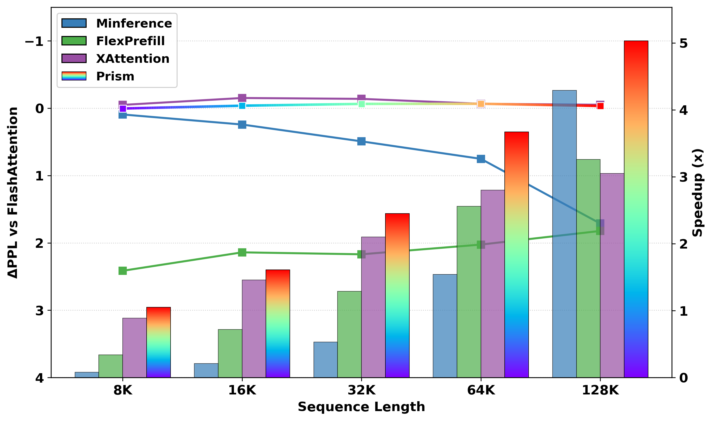
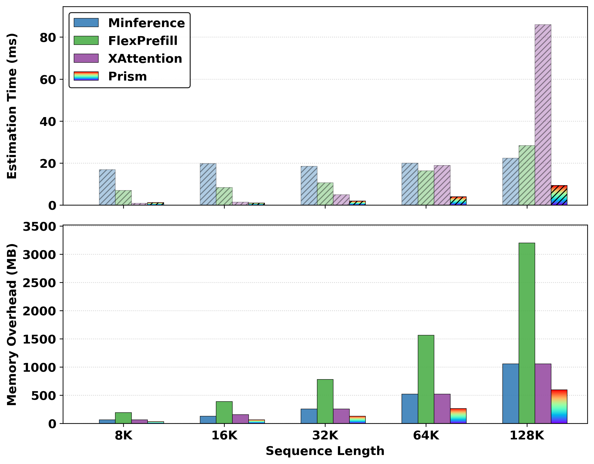

# Prism: Spectral-Aware Block-Sparse Attention
<a href="https://arxiv.org/abs/2602.08426" target="_blank"> </a> <a href="https://efficacious-citrus-7a0.notion.site/Prism-Spectral-Aware-Block-Sparse-Attention-304d97f5df9d80318802f9cb37d18c3e" target="_blank"> </a>
## Overview
Prism is a training-free method to accelerate long-context LLM pre-filling. It addresses the "blind spot" in standard mean pooling caused by Rotary Positional Embeddings (RoPE) by disentangling attention into high-frequency and low-frequency bands.

**Key Features:**
*   **Dual-Band Importance Estimation:** Separates semantic (low-freq) and positional (high-freq) signals.
*   **Energy-Based Calibration:** Restores attenuated signals automatically.
*   **Speed:** Up to **5.1× speedup** on 128K context with negligible accuracy loss.
*   **Implementation:** purely block-level operations with custom Triton kernels.

<p align="center">


</p>

## Repository Structure
*   `prism/`
    *   `prism.py`: Core implementation of Prism.
    *   `kernels/`: Custom Triton kernels for efficient block importance estimation with Prism and block-sparse attention.
*   `baselines`: Baseline implementations (e.g., MInference, FlexPrefill, Xattention).
*   `eval/`: Evaluation harnesses.
*   `data/`: Example data for demonstration.
*   `scripts/`: Shell scripts to reproduce the experiments in the paper.

## Installation
```bash
# For core Prism implementation only
uv pip install -e .

# For lm-eval evals
uv pip install -e "eval/lm-evaluation-harness["hf", "longbench", "ruler"]"

# For lmms-eval evals
uv pip install -e "eval/lmms-eval["qwen", "metrics"]"

# For baselines
# FlashAttention
uv pip install flash_attn --no-build-isolation
# Minference
uv pip install minference
# XAttention
git clone git@github.com:mit-han-lab/Block-Sparse-Attention.git
cd Block-Sparse-Attention && uv pip install -e .
```

## Example Usage
A simple example Prism using Qwen3-0.6B with a RULER example.
```python
python -m prism.prism
```
Alternatively, patch your model with Prism for broader usage:
```python
from prism import prism_attention_forward
from prism.utils.patch import apply_patch
from transformers import AutoModelForCausalLM

apply_patch(
    forward_fn=prism_attention_forward,
    model_id="Qwen/Qwen3-8B",
)

model = AutoModelForCausalLM.from_pretrained("Qwen/Qwen3-8B")
```

## Evaluation
To reproduce the evaluation results, please refer to the scripts in the `scripts` directory.
```bash
# Example: Running LongBench Evaluation on Qwen3-8B
bash scripts/longbench.sh
```

**Note:** For RULER evaluation, we use Qwen3 with YaRN extrapolation, consistent with the official implementation. Please ensure your `MODEL_ID` points to a model path containing the [modified `config.json`](https://huggingface.co/Qwen/Qwen3-8B#processing-long-texts) required for long-context processing.

## Citation
If you find this work helpful, please consider citing our paper as following:
```
@misc{wang2026prismspectralawareblocksparseattention,
      title={Prism: Spectral-Aware Block-Sparse Attention}, 
      author={Xinghao Wang and Pengyu Wang and Xiaoran Liu and Fangxu Liu and Jason Chu and Kai Song and Xipeng Qiu},
      year={2026},
      eprint={2602.08426},
      archivePrefix={arXiv},
      primaryClass={cs.CL},
      url={https://arxiv.org/abs/2602.08426}, 
}
```